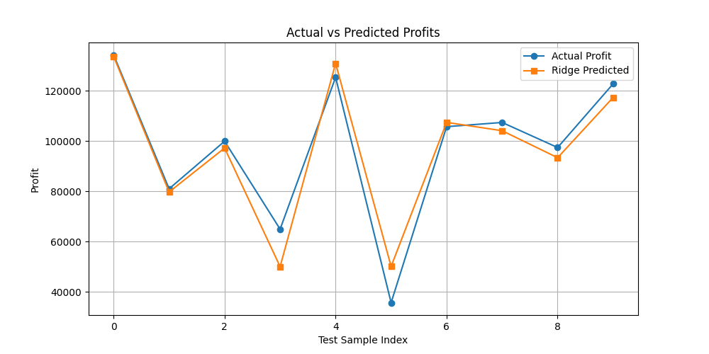

# 🚀 Startup Profit Prediction using Ridge Regression

This project predicts the profit of a startup based on various investment features using Ridge Regression. It is built with Python, trained on the `50_Startups.csv` dataset, and deployed as a Flask web application.

---

## 🧠 Machine Learning Model

- **Model Used:** Ridge Regression
- **Features:** 
  - R&D Spend
  - Administration
  - Marketing Spend
  - State (One-hot encoded)
- **Target:** Profit

The model is trained using the scikit-learn library and serialized using `pickle`.

---

## 🗂 Project Structure

```
├── Images
│   └── Figure_1.png
├── model
│   ├── ridge_model.pkl
│   └── features.pkl
├── templates
│   └── index.html
├── 50_startups.csv
├── app.py
├── startup.py
└── README.md
```

---

## 🚀 How to Run the Project

### 🔧 1. Clone the Repository

```bash
git clone https://github.com/SamStephen007/startup-profit-predictor.git
cd startup-profit-predictor
```

### 🐍 2. Install Dependencies

```bash
pip install -r requirements.txt
```

**`requirements.txt`**
```
flask
numpy
pandas
scikit-learn
```

### ⚙ 3. Train the Model (Optional)

If you want to retrain:

```bash
python startup.py
```

This will generate:
* `model/ridge_model.pkl`
* `model/features.pkl`

### 🌐 4. Run the Flask App

```bash
python app.py
```

Then visit: [http://localhost:5000](http://localhost:5000)

---

## 🖥 Frontend

The frontend is a simple HTML form (`templates/index.html`) that collects input for:

* R&D Spend
* Administration
* Marketing Spend
* State

Upon submission, it displays the predicted profit from the ML model.

---

## 📊 Example Prediction

**Input:**
- R&D Spend: 165000
- Administration: 120000
- Marketing Spend: 300000
- State: California

**Output:**
- Predicted Profit: $192,221.42

---

## 📸 Visualizations



---

## 📁 Dataset

* **File:** `50_startups.csv`
* **Source:** Public startup dataset containing 50 samples

---

## 🙋‍♂ Author

**Sam Stephen**  
If you like this project, feel free to ⭐ it or suggest improvements.
